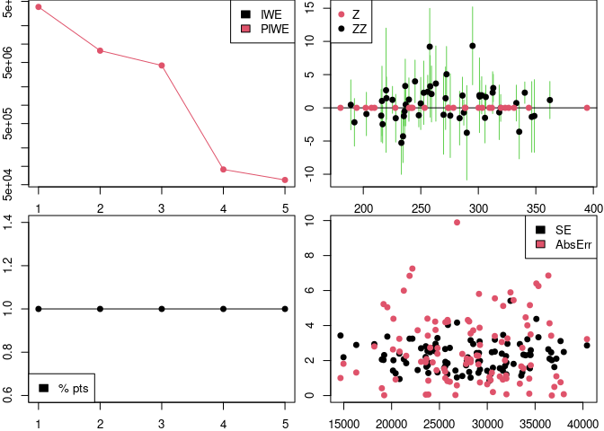

<!-- README.md is generated from README.Rmd. Please edit that file -->

# GradAdaptCompExp

<!-- badges: start -->
<!-- badges: end -->

The goal of GradAdaptCompExp is to provide code for managing computer
experiments.

## Installation

You can install the development version of GradAdaptCompExp from
[GitHub](https://github.com/) with:

``` r
# install.packages("devtools")
devtools::install_github("CollinErickson/GradAdaptCompExp")
```

## Example

This is a basic example which shows you how to solve a common problem:

``` r
library(GradAdaptCompExp)
#> Registered S3 method overwritten by 'DoE.base':
#>   method           from       
#>   factorize.factor conf.design
## basic example code
```

``` r
# wing weight, grad_norm2_mean, laGP_GauPro_kernel
set.seed(1); a <- adapt.concept2.sFFLHD.R6$new(
  D=10,L=5,func=TestFunctions::wingweight, nugget = 1e-7,estimate.nugget = T,
  obj="desirability", des_func=des_func_grad_norm2_mean,
  actual_des_func=NULL,#get_num_actual_des_func_grad_norm2_mean(),
  stage1batches=6, alpha_des=1, weight_const=0,
  package="laGP_GauPro_kernel", design='sFFLHD_Lflex',
  error_power=2,
  selection_method="max_des_red_all_best"
); 
#> no suitable  resolution IV or more  array found
#> no suitable  orthogonal  array found
#> sFFLHD_Lflex requested L=5, but using L=11
a$run(5, noplot = TRUE)
#> Starting iteration 1 at 2021-11-13 21:54:19 
#> no suitable  resolution IV or more  array found
#> Warning in DoE.base::oa.design(nruns = L^2, nfactors = D + 1, nlevels = L, :
#> resources were not sufficient for optimizing column selection
#> Starting iteration 2 at 2021-11-13 21:54:22 
#> stage1batch adding
#> Starting iteration 3 at 2021-11-13 21:54:25 
#> stage1batch adding
#> Starting iteration 4 at 2021-11-13 21:54:28 
#> stage1batch adding
#> Starting iteration 5 at 2021-11-13 21:54:32 
#> stage1batch adding
a$plot1()
```


